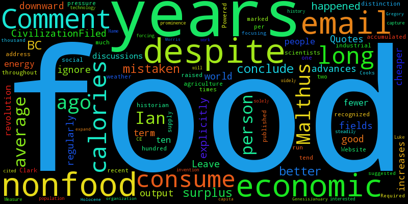

# RSS-Word-Cloud
Creates a word cloud from the content of a RSS feed

# Installation
Sorry I don't know any of the fancy python distribuiting stuff, so we'll have to do this the old fashioned way:
```
git clone https://github.com/nicholasRutherford/RSS-Word-Cloud.git
cd  RSS-Word-Cloud
pip install -r requirements.txt
```
# Running
Once everythind is downloaded you can run it simply by `python rssSum.py` and then it will produce a file called `image.png` that will contain the word cloud for the feed.

## Example
```
$ python rssSum.py
Enter the url of the feed: http://feeds.feedburner.com/LukeMuehlhauser
Retrieving rss feed...
Downloading and parsing pages...
 90.0%
Constructing cloud...
Done!
```
Produces:


# Third party libraries
* FeedParser - Handles the RSS file
* BeautifulSoup4 - Parse the html files
* WordCloud - Produces the world cloud
